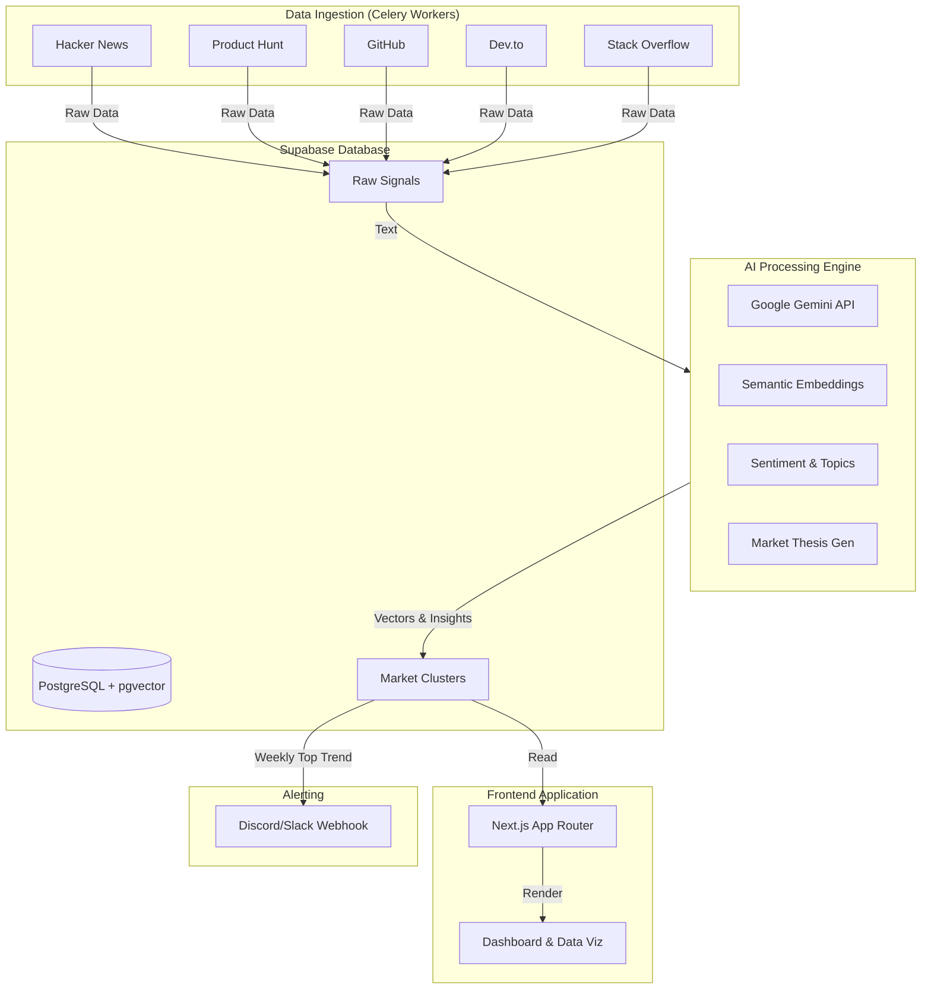

# Market Pulse 📈

Market Pulse is an AI-powered market intelligence platform that ingests public social signals, enriches them with AI, clusters related demand patterns, and serves ranked opportunities in a dynamic web feed. 

It is designed to help builders, founders, and investors find "whitespace" opportunities by automating the heavy lifting of market research.

## Features

- **Automated Data Ingestion:** Scrapes signals continuously from Hacker News, Product Hunt, Stack Overflow, Dev.to, and GitHub.
- **"Whitespace" Opportunity Detector:** Highlights high-friction, high-discussion problems that have zero startup solutions built yet.
- **Semantic Search:** Query the database using natural language (e.g., "AI tools for accountants") powered by Gemini embeddings and Supabase `pgvector`.
- **AI Market Thesis Generation:** Automatically synthesizes raw market signals into cohesive, VC-grade investment theses using `gemini-2.5-flash`.
- **Weekly Intel Broadcasts:** Pushes the highest-momentum trends and their market theses directly to a Discord/Slack webhook.

## Architecture



## Tech Stack

- **Frontend**: Next.js 16 (App Router), TailwindCSS, Recharts, React Markdown
- **Backend / Workers**: Python 3.11+, Celery, Redis (Broker/Backend)
- **Database**: Supabase (PostgreSQL) + `pgvector`
- **AI Models**: Google Gemini (`gemini-2.5-flash` for synthesis, `text-embedding-004` for vectors)

## Repository Layout

```
market-pulse/
├── frontend/                 # Next.js app + API routes
├── worker/                   # Celery workers for ingestion and AI processing
├── supabase/
│   └── schema.sql            # Postgres schema and pgvector RPCs
├── docker-compose.yml        # Local multi-service runtime
└── README.md
```

## Prerequisites

- Docker + Docker Compose
- Node.js 20+ (for local frontend dev)
- A Supabase project
- API credentials for Google Gemini and data sources

## Getting Started

### 1. Environment Variables

Create `.env` files in your project roots using `.env.example` as a template, or generate three separate env files:

1. `market_pulse/.env` (For Docker Compose)
2. `market_pulse/worker/.env` (For local Python development)
3. `market_pulse/frontend/.env.local` (For local Next.js development)

Minimum required variables:
```bash
ENVIRONMENT=development
SUPABASE_URL=https://your-project-ref.supabase.co
SUPABASE_SERVICE_ROLE_KEY=your_service_role_key
GOOGLE_API_KEY=your_gemini_api_key
```

### 2. Database Setup

1. Create a Supabase project.
2. Open the Supabase SQL Editor.
3. Run all the SQL provided in `supabase/schema.sql` to initialize tables, `pgvector`, and RPC functions.

### 3. Run with Docker (Recommended)

To launch the Redis broker, Celery workers, Celery Beat scheduler, and Next.js frontend all at once:

```bash
docker-compose up --build
```

- **Frontend UI:** `http://localhost:3000`
- **API Health:** `http://localhost:3000/api/health`

### 4. Run Locally (Without Docker)

**Worker (Python):**
```bash
cd worker
python -m venv .venv
source .venv/bin/activate
pip install -r requirements.txt

# Run the Celery worker
celery -A celery_app worker --loglevel=info

# Run the Celery beat scheduler (in another terminal)
celery -A celery_app beat --loglevel=info
```

**Frontend (Next.js):**
```bash
cd frontend
pnpm install
pnpm dev
```
